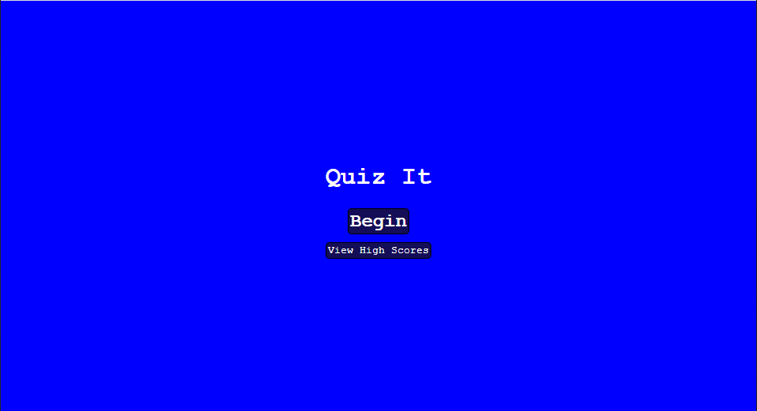

# quiz-it
A sample quiz application.

Quiz It is an application that currently allows users to challenge themselves in answering a series of questions based on HTML, CSS and JavaScript. Upon completing the quiz the user is able to enter an identifier to save along with their score (the amount of time left after the final question). The higher the score (more time left), the better.

Quiz It application is currently available at <https://jasonarritt.github.io/quiz-it/>